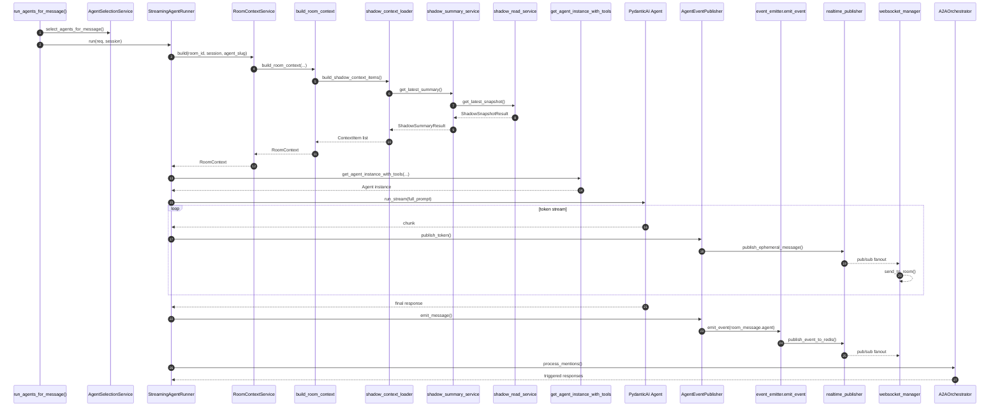

```mermaid
%% Agent Streaming Sequence (services)
%% Focus: agent run + context building + streaming + A2A triggers.
sequenceDiagram
  autonumber
  participant Caller as run_agents_for_message()
  participant Selection as AgentSelectionService
  participant Runner as StreamingAgentRunner
  participant Context as RoomContextService
  participant Provider as build_room_context
  participant Shadow as shadow_context_loader
  participant Summary as shadow_summary_service
  participant Read as shadow_read_service
  participant Agent as get_agent_instance_with_tools
  participant LLM as PydanticAI Agent
  participant Events as AgentEventPublisher
  participant Emit as event_emitter.emit_event
  participant Redis as realtime_publisher
  participant WS as websocket_manager
  participant A2A as A2AOrchestrator

  Caller->>Selection: select_agents_for_message()
  Caller->>Runner: run(req, session)
  Runner->>Context: build(room_id, session, agent_slug)
  Context->>Provider: build_room_context(...)
  Provider->>Shadow: build_shadow_context_items()
  Shadow->>Summary: get_latest_summary()
  Summary->>Read: get_latest_snapshot()
  Read-->>Summary: ShadowSnapshotResult
  Summary-->>Shadow: ShadowSummaryResult
  Shadow-->>Provider: ContextItem list
  Provider-->>Context: RoomContext
  Context-->>Runner: RoomContext

  Runner->>Agent: get_agent_instance_with_tools(...)
  Agent-->>Runner: Agent instance
  Runner->>LLM: run_stream(full_prompt)
  loop token stream
    LLM-->>Runner: chunk
    Runner->>Events: publish_token()
    Events->>Redis: publish_ephemeral_message()
    Redis-->>WS: pub/sub fanout
    WS-->>WS: send_to_room()
  end

  LLM-->>Runner: final response
  Runner->>Events: emit_message()
  Events->>Emit: emit_event(room_message.agent)
  Emit->>Redis: publish_event_to_redis()
  Redis-->>WS: pub/sub fanout

  Runner->>A2A: process_mentions()
  A2A-->>Runner: triggered responses
```
